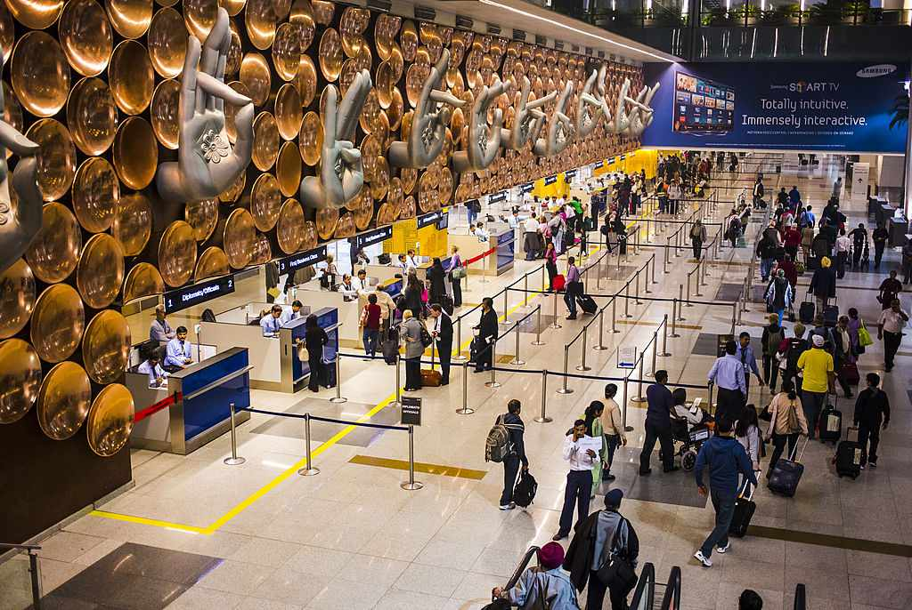

# Revolutionizing Railway Station Management through Innovative Technology

## Table of Contents
- [Introduction](#introduction)
- [Problem Statement](#problem-statement)
- [Solution Overview](#solution-overview)
- [Key Features](#key-features)
- [Getting Started](#getting-started)
  - [Prerequisites](#prerequisites)
  - [Installation](#installation)
- [Usage](#usage)
- [Contributing](#contributing)
- [License](#license)
- [Acknowledgments](#acknowledgments)

## Introduction

Welcome to our groundbreaking solution designed to revolutionize railway station management through innovative technology. In the vast and bustling landscape of Indian Railways, our mission is to address the pressing challenges associated with crowd management, crime prevention, work supervision, and crisis management, using cutting-edge solutions.

## Problem Statement

**The Challenge:** Indian Railways, one of the world's largest railway networks, faces an unprecedented surge in passenger numbers and train services. This exponential growth has brought forth critical issues in railway station management, including:

- Overcrowding and inadequate crowd control
- Security concerns and the need for crime prevention
- Inefficiencies in work supervision and maintenance
- Crisis management readiness

Traditional methods are proving inadequate in effectively addressing these challenges, necessitating a transformative solution.

## Solution Overview

**Our Innovative Approach:** Our solution offers a comprehensive, seamlessly integrated platform that leverages existing CCTV camera networks with advanced features and enhancements. This platform is designed to be scalable and applicable to multiple stations, ensuring adaptability to diverse railway environments.

## Key Features

Our solution encompasses a wide range of features and functionalities, each meticulously crafted to address specific challenges:

- **Crowd Management:**
  - Real-time crowd analysis
  - Queue detection
  - Thermal screening (optional)
  - People counting
  - User-friendly app for passengers

- **Crime Prevention and Behavior Analysis:**
  - Behavior scrutiny
  - Facial recognition
  - Intrusion detection
  - Emergency response app
  - Safety alerts

- **Work Monitoring:**
  - Asset tracking
  - Maintenance oversight
  - Worker safety via wearable devices
  - Quality control
  - Digital documentation

- **Criminal Detection and Database Enhancement:**
  - Comprehensive criminal database integration
  - Continuous monitoring
  - Database augmentation

- **Crisis Management:**
  - Swift crisis response
  - Emergency communication channels
  - Seamless coordination with authorities

- **Geofencing and Super Admin:**
  - Enhanced security measures with geofencing
  - External security coordination through a Super Admin role

- **No Learning and Zero Learning:**
  - User-friendly design with no extensive training requirements

## License

This project is licensed under the [License Name] - see the [LICENSE.md](LICENSE.md) file for specific details regarding our licensing terms.
